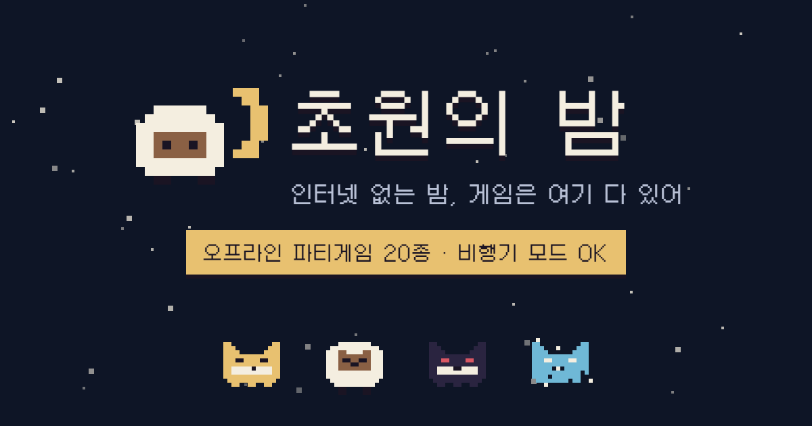
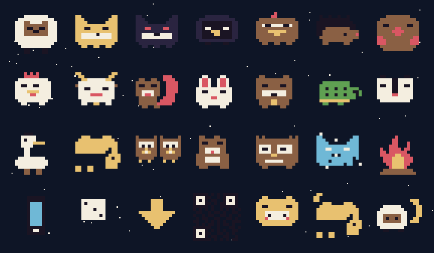

<p align="center">
  
</p>

<h1 align="center">🌙 초원의 밤</h1>

<p align="center">
  <b>몽골 여행용 오프라인 파티게임 PWA</b><br>
  폰 1대를 돌려가며 노는 패스앤플레이 · 도트 8비트 감성 · 비행기 모드 OK
</p>

<p align="center">
  <a href="https://noino0819.github.io/mongol_night/"><b>▶ 지금 플레이하기</b></a>
</p>

---

## ✨ 특징

- 📴 **오프라인 100%** — 외부 요청 0건. 한 번 설치하면 초원 한가운데서도 전부 돌아감
- 📱 **PWA** — 홈 화면에 추가하면 진짜 앱처럼 (설치 후 인터넷 없이 실행)
- 🕹️ **폰 1대 패스앤플레이** — 계정도, 서버도, 두 번째 폰도 필요 없음
- 🎨 **16×16 도트 + 8색 팔레트** — 스프라이트는 이미지 파일이 아니라 문자열 맵 → canvas 렌더
- 📦 **단일 HTML** — 의존성 0개, 빌드 0단계

## 🎮 게임 목록 (15종, 확장 중)

| 게임 | 어떤 게임? |
|---|---|
| 🐺 **라이어 게임** | 딱 한 명만 제시어를 모른다. 말로 버티고, 투표로 잡아라 |
| 🌙 **마피아** | 사회자 없이 진행되는 클래식 마피아 |
| 🌕 **한밤의 늑대인간** | 마피아 10분 압축판 — 밤 능력 쓰고, 투표는 딱 한 번 |
| ⚡ **초성 퀴즈** | 초성만 보고 먼저 외치는 사람이 1점 |
| ⚖️ **밸런스 게임** | 극한의 양자택일, 소수파는 벌칙 ㅋㅋ |
| 🔔 **과일 종!** | 같은 과일 합이 정확히 5가 되면 먼저 탭 |
| ⚫ **오목** | 설명이 필요 없는 1:1 두뇌 대결 |
| 🎤 **이마 퀴즈** | 폰을 이마에 대면 나머지가 말·몸짓으로 설명 |
| 🐑 **몽골 대장정 2.0** | 부루마블 스타일 — 초원 사고, 게르 짓고, 결투는 실제 미니게임 현피 |
| 🎨 **그림 릴레이** | 그림 → 추측 → 그림 → 추측… 마지막에 변천사 대공개 |
| 🖍️ **그림 퀴즈** | 그리는 사람만 제시어를 아는 캐치마인드 |
| 🃏 **인디언 포커** | 남의 카드는 보이고 내 카드만 안 보이는 심리 배팅 |
| 💣 **폭탄 돌리기** | 답을 외쳐야 패스 가능, 터질 때 들고 있으면 벌칙 |
| 💭 **텔레파시 게임** | 몰래 같은 답을 쓰면 점수 — 우리 일행, 얼마나 통할까 |
| 🎯 **복불복 룰렛** | 벌칙은 룰렛이 정한다 |

> 🚧 확장 예정: 주사위 배팅 · 버저 퀴즈 · 숫자야구 · 몽골 상식 퀴즈 · 텍스트 어드벤처 **「고비의 별」**

## 🐑 마스코트 도감 (28종)

<p align="center">
  
</p>

전부 16×16 · 8색 팔레트로 그려진 자체 제작 스프라이트. 코드에서는 이미지 파일이 아니라
[assets/sprites.js](assets/sprites.js)의 문자열 맵을 canvas로 렌더링한다 (앱 아이콘·OG 이미지도 여기서 생성).

## 📲 설치 (여행 출발 전에!)

1. 폰에서 [플레이 링크](https://noino0819.github.io/mongol_night/) 열기
2. **홈 화면에 추가** — iOS: 공유 → 홈 화면에 추가 / Android: 메뉴 → 앱 설치
3. 비행기 모드 켜고 한 번 실행해서 잘 도는지 확인 ✅

## 🛠️ 개발

```bash
node tools/serve.mjs            # 로컬 서버
node tools/gen-assets.mjs       # 아이콘·OG 재생성 (원본: assets/sprites.js)
node tools/gen-readme-sprites.mjs  # README 스프라이트 도감 재생성
```

구조는 `index.html`(게임 전부) + `sw.js`(전체 프리캐시) + `manifest.webmanifest`가 전부.
수정 후에는 `sw.js`의 버전(`V`)을 올려야 설치된 폰에 반영된다.

## 🗺️ 로드맵

- [x] **M1** — PWA화 + 도트 디자인 시스템
- [x] **M2** — 홈 IA + 앱 셸 (스플래시 · 온보딩 · 설정 · 홈 카테고리/필터/즐겨찾기)
- [ ] **M3** — 게임 콘텐츠 확장 (이월 3종 · 상식퀴즈 · 밸런스 1000문항 · 게임 스킨)
- [ ] **M4** — 텍스트 어드벤처 「고비의 별」
- [ ] **M5** — 마감 · QA · 실기기 테스트

## 📜 크레딧

- 픽셀 폰트: [Galmuri](https://galmuri.quiple.dev/) — SIL Open Font License 1.1 ([전문](assets/fonts/LICENSE-OFL.txt))
- 도트 스프라이트 · 게임 디자인: 자체 제작
